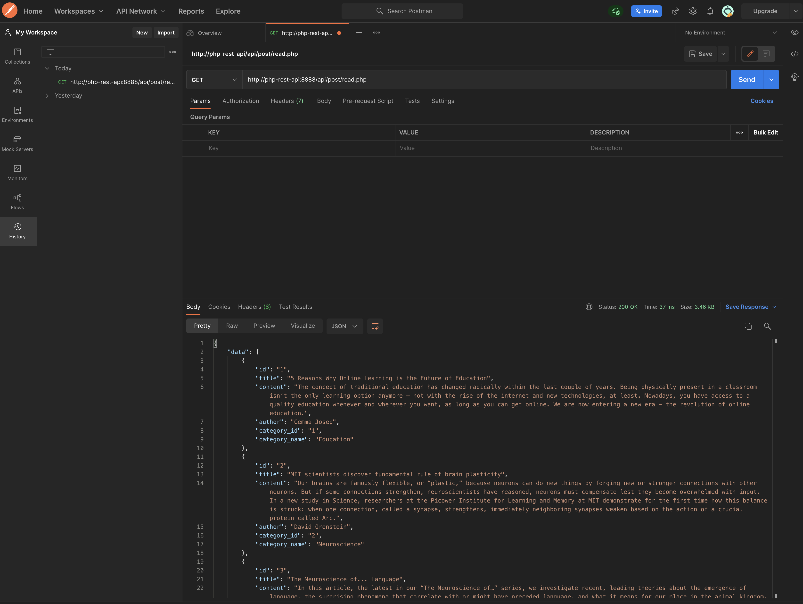

# PHP REST API

A REST API that fetches blog post data.

### How It Works

1. Create a new database in PHP MyAdmin ('phpblog' or your own name and adjust the param). 
2. Import the included phpblog.sql file or create your own and adjust the params.

### Author
Alex Corvin

### Version 
1.0.0

### License

